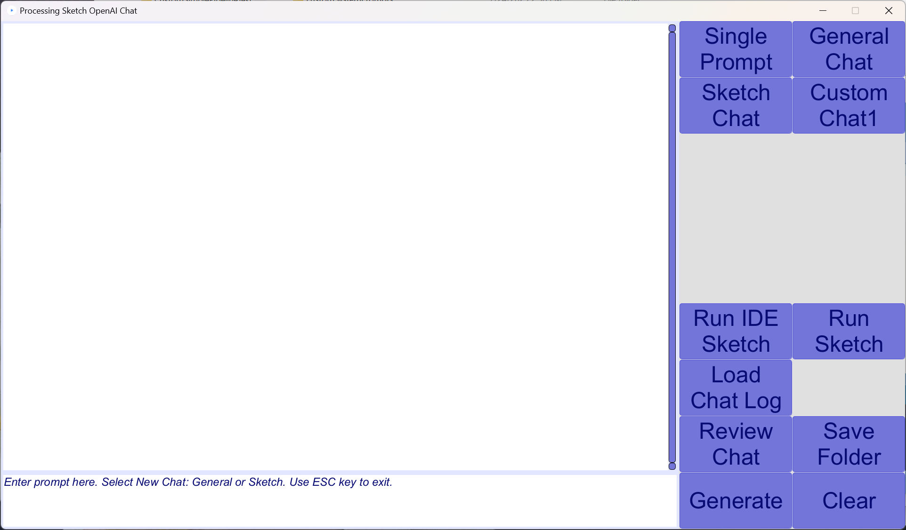

# Processing-Sketch-Chatbot
Processing Sketch Chatbot is an OpenAI artificial intelligence based assistant for learning and generating sketch code.

Processing is a programming language and development environment built for the electronic arts, new media art, and visual design communities 
with the purpose of teaching non-programmers the fundamentals of computer programming in a visual context. 
It's primarily used for creating graphics, animations, and interactive experiences, 
and is also capable of building small sized applications on several platforms (Windows, Linux, iOS, Javascript-P5, Android, and Python).
Processing Development Environment (PDE) is a Processing sketch application. 
The Processing IDE, Integrated Development Environment, is a Processing sketchbook with code editor, debugger, and run execution capabilities for sketches. 

## Introduction
The Processing Sketch Chatbot is an application tool to assist users of the Processing.org IDE (Integrated Development Environment) 
in generating and running code from responses to
prompts sent to the OpenAI ChatGpt service using Java based API (Application Program Interface). 
This respository is work in progress and it only implements essential features to implement a chat prompt request
and run the response code. 

The application is written in the Processing Java language and currently only runs on Windows platform
(due to the library used for GUI is only available for Windows).
It requires an OpenAI API key subscription from OpenAI.org.

Chat responses cause an instance of the sketch to be run with the IDE when a "Run" key is pressed.

## Background
I'm a retired software engineer who likes to code with Processing (since 2010) for many of my camera, photography, and photo art projects.

To learn more about the AI and machine learning revolution going on now, here I wrote a Processing sketch code assistant chatbot using Java API calls to OpenAI.org. 
My chatbot application can be modified for other chatbot application uses besides programming.
Only a small number of the API calls are invoked.

## Usage
A code assistant is helpful writing sketches quickly, and avoids some tedium and mistakes during the program development process.
You cannot trust the output response from the chatbot and have to read and understand the generated code. (Although it is often correct)

I find specific prompts are best to get good generated sketch code. And after a few prompts for requesting changes, I find it easier
to just make code changes myself. Or start a new chat to assist with another section of the code I am trying to build and
then integrate it into the final sketch I seek to write.

One time the Chatbot could not figure out how to generate code for a specific request and told me. I solved this by
instructing the Chatbot to use a specific class or technique and it worked.

The advantage of this application is that it sets up a specific chat assistant for Processing.
You can run the generated code directly with the IDE, rather than copying and pasting.

The OpenAI model used in the application by default is "gpt-4" and 
randomness in responses is limited by the temperature variable set to 0.

You can build your own custom chat by creating a system prompt text file and loading it with the custom chat soft key.
This is similar to custom instructions available in online OpenAI ChatGPT. Use it for specific tasks you want to have your chatbot perform.

## Setup
The Processing Sketch Chatbot application runs on Windows 11 and requires Processing 4.2 or later versions.
Install the Processing IDE, Windows 64 bit, from [www.processing.org/download](https://processing.org/download)
The previous major version of the Processing IDE (3.5.4) will not build this application.

After installing the Processing IDE, note the folder location of the IDE processing.exe run file.
Add the folder location to the Path environment variable in the Windows system environment settings.
This is required for seamless starts of the IDE from the chatbot when you make a run request on code generated using the chatbot.

### OpenAI Api Key
You will need OPENAI API payment account to use this chatbot application. 
See [OpenAI](https://openai.com/) for information about setting up an API account. 
The API by this application used is currently described at https://openai.com/product#made-for-developers
The application defaults to "gpt-4" model, but can be changed if you build the chat application yourself.
I found the GPT4 model gives the best generated code.

The application makes API calls into the OpenAI endpoint servers and requires an identifying token with API requests.
The application reads a Windows environment variable, OPENAI_API_KEY, for your OpenAI API account token.
Define your OpenAI API Key as variable name "OPENAI_API_KEY" in the Windows environment settings.
Store the account token as the value of the variable.

### IDE Modes
When you request code generation for your Processing sketch project, you can prompt for one of the modes Processing IDE sketches could use.
Generated code can be run in the IDE in the following modes: Java, p5.js (based on Javascript), and Python. 
Android mode is not available yet with the application, but you can still prompt for Android java/kotlin code if you wish.
Make sure the modes you want to run with the generated code are included in the IDE by adding in "manage modes" setup.

### IDE Libraries 
In the IDE enter menu: Sketch -> Import Library -> Manage Libraries... menu selection you can add libaries used by the application.

To build the chatbot application requires the IDE Library:

1. G4P - A graphical user interface library that provides a set of 2D GUI controls and multiple window support. 
This library only runs on Windows and is why the application is only available with Windows at this time.

To run generated code with with the IDE may require other contribution libraries:

1. Other - This is dependent on the generated code response from prompts.

## Application Support Libraries

### Openai-java
The application uses the OpenAI-Java API from the Github implementation (version 0.15.0) found at
https://github.com/TheoKanning/openai-java - thank you Theo Kanning!

I use the build with OpenAI-Java (gradlew) to determine the library jar files needed. 
This command line in Windows uses the gradlew command in info debug mode with a request to build an distribution zip file.

.\gradlew --info example:distZip

The zip file in example/build/distributions, example.zip, is unzipped and 
then copy jar files from example/lib folder into the "code" folder used by this application sketch.

### Gpt-engineer
After I started this project I noticed https://github.com/AntonOsika/gpt-engineer
This is an exciting and ambitious project to guide and build a complete software development using ChatGPT from OpenAI.
I will incorporate some ideas from gpt-engineer into this project.
